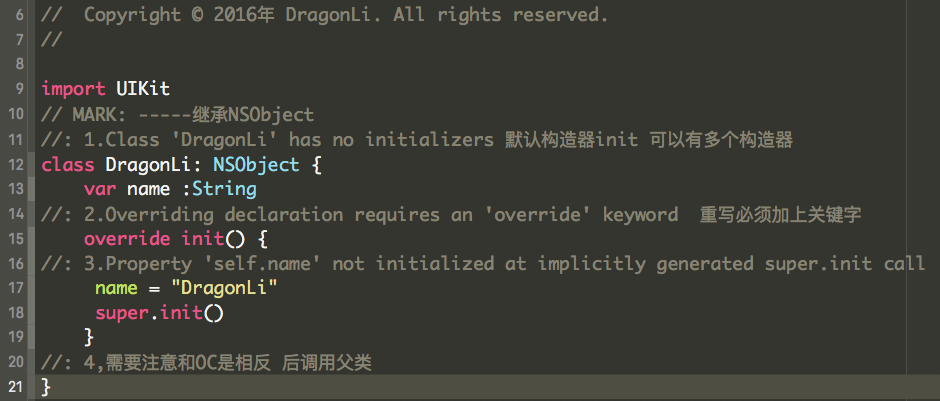

 
#Swift  
1. Constants, variables, strings
2. The dictionary, arrays, tuples
3. The basic operators, control flow, optional
4. Functions,enum
5. closures
6. Class,Struct 
7. Attribute , inheritance
8. The construction and destruction
9. Optional even,Type conversion, nested types
10. Reference,Protocal
11. Generic and accessControl
12. Error and ProtocalPro
13. swiftOperation/MapAndFlatMap!

##Swift版本更新记录

	-Swift取消了预编译指令.
	-舍弃OC的Smalltalk的语法,改为点语法.
	-类似java的名字空间,泛型,运算对象重载.
	-移除自增运算符++和自减运算符—-
	-移除C语言风格的for循环（条件与增量下）
	-移除C语言风格的for循环（条件与增量下）
	
	
## 部分总结
#### 1.1 非Optional属性,都必须在构造函数中初始化,从而保证在对象在实例化能被正确分配空间
	

##有任何问题，请及时 issues me 
 <dragonli_52171@163.com>   
 
## License

English: this library is available under the MIT license, see the LICENSE file for more information.  